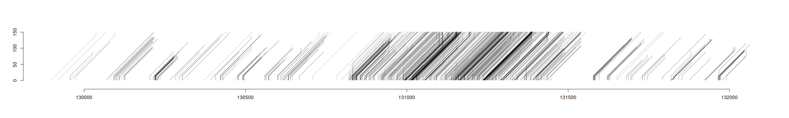

# Motivation

`read_bam` provides a few functions to read and parse bam data into native R
data structures. This probably overlaps with functionality in `rbamtools` and
`rsamtools`, but it differs in that it has minimal external dependancies and
all data is returned as core `R` data structures that can be used directly.

The code relies on `htslib` which needs to be installed somewhere on the target
system. I suspect this makes it difficult to install on a Windows based system.

For documentation and example use of the functions provided, see
further down in this file, or use the source (`read_bam.R`, and
`src/read_bam.c`). For [very messy] examples, see the `tests/test.R`
file.

My motivation for writing this was to a large extent to have a
*simple* code base with minimal dependancies that can reasonably
efficiently convert bam data into data structures that allow
visualisation and statistical analyses using core `R`
functions. `read_bam.c`, is currently around 2000 lines of code, which
is a little more than I would like, but it is not *too* difficult to
read. Unfortunately the amount of `C` code will probably
grow. 


Simplicity in this case isn't so much the amount of code, but primarily a
matter of reducing the number of levels of abstraction used. Reducing this
means that it is easier to find the code that implements a particular
function; and this in turn (to me anyway) makes it easier to modify the code
to do different things when needed. There are several obvious disadvantages to
this, but I find this approach easier compared to either using or defining
universally useful APIs.

NOTE 1: this README.md is in a state of flux and is not internally consistent.
This should improve with time.

NOTE 2: I will probably move documentation to a separate sub-directory as this
file is getting a bit too long and cumbersome.

NOTE 3: This file is likely to include erronous statements. It has not been
proof-read in any way.

# Installation (compilation)

To use `read_bam` you will need to:

1. Install the `htslib` library. Instructions are available from the `htslib`
   github repository. You will need to be aware of where the `include` and
   `library` files are installed to. If you are root and use the usual,
   `./configure`, `make` and `make install`, then this will be in
   `/usr/local/`. If you do not have root access, have a look at the output of
   `./configure --help`. You can set the `prefix` to a location in your own
   home directory.
2. Make the `htslib` library available to the linker. To do this, read up on
   the use of the environment variable `LD_LIBRARY_PATH` and the `ldconfig`
   program if you don't know what this means. If you have a working `samtools`
   installation then it is likely that this has already been done. But you need
   to make sure that the header files that are included during installation
   refer to the library that the linker will load.
3. Compile the `read_bam` source code in order to create a shared object
   (`.so`) file (on windows these are known as `.dll` for dynamically linked
   libraries). Fortunately, `R` has a function for doing this and as long as
   you are using a linux system it is generally straightforward.

There are lots of ways in which steps 1 and 2 might end up failing or not
working with step 3. Don't be put off by this as it's not actually that
difficult to make it work (though it may be rather more difficult to
understand everything). And you are not going to break anything by trying.

If you do try and fail, feel free to send me a message; I don't expect
many users so this isn't likely to be much of a problem.

To compile the `read_bam` library, first have a look at the `src/Makevars`
file. It includes the line:

```sh
PKG_LIBS=-lhts
```

in addition to a commentary describing what this does and what is
needed. This line tells `R` that the shared object (i.e. the library)
needs to be linked to `libhts` and makes sure that `R` will pass the
option `CFLAGS=-lhts` to gcc. Read the comments; it is possible that you
may need to modify the Makevars file to compile the library.

If you have installed `libhts` to a non-standard directory, then you
should probably include something like:

```sh
PKG_CPPFLAGS='-I<libhts installation directory>'
```

in the `Makevars` file. I haven't actually tried, but something like
that should work.

Change to the `src` subdirectory and use `R CMD SHLIB` to create the library
file:

```sh
## make sure you have changed directory to the place you have
## downloaded the files to and:
cd src
R CMD SHLIB read_bam.c common.c
```

This should produce three new files: `read_bam.o`, `common.o` and
`read_bam.so`. The last of these three is the library file. This needs
to be loaded in order to use the compiled functions. This is done
using the `dyn.load`, which is called as the first line from the
`read_bam.R` file.  Hence you can simply source the `read_bam.R` file
in order for the functions to be available (see usage).

# Usage

To use the functions. From an `R` session:

```R
source("<path_to_code/read_bam.R>")
```

You may get some error messages about `libhts` not being available; if this
is the case then it means that your linker has not been configured to look
for `.so` files in the location where `libhts` has been installed. If `libhts`
has been installed globally you may need root to run `ldconfig`; otherwise you
can consider setting the `LD_LIBRARY_PATH` environment variable or recompiling
the library with the `-rpath-link` option set to an appropriate value (I don't
know exactly how to do this, but google is your friend; maybe chatGPT might
give you an answer as well).

Sourcing `read_bam.R` defines a number of wrapper and accessory functions.
This is different from what happens when you use `library` (or `require`) to
import a package; in particular, all functions that are defined in
`read_bam.R` can be seen as normal `R` objects when you call `ls()`; this is
not always ideal, but I currently have no desire to make the functions
available as part of a proper `R` package as doing so precludes changing the
API in future versions (and is more work).

To access data in `bam` or `bcf` files you first need to create a handle for
the files; this is done using the `load.bam` or `load.bcf` functions. These
return what are known as external pointers; you cannot do very much with them
yourself, but you will need to pass them as arguments to functions accessing
data from `bam` and `bcf` files. Note that the external pointers do not
survive R save and reload cycles. They will hence need to be recreated if you
save and then reload your image. There are ways in which this can be done by
any function needing the pointer, but I have not implemented them.

## A use example

If I have installed `read_bam` in `~/R/Read_bam`, have a sorted and indexed
bam file in my current working directory called `test.bam` with an index
called `test.bam.bai` then the following can be used to obtain all alignments
to the longest reference sequence:

```R
## import the functions using source
source("~/R/Read_bam/read_bam.R")

## Create the external pointer
bm <- load.bam("test.bam", "test.bam.bai")

## Obtain the lengths of the reference sequences as
## a named integer vector:
ref.lengths <- target.lengths(bm)

## sort ref.lengths long to short
ref.lengths <- sort(ref.lengths, decreasing=TRUE)

## obtain all alignments from the longest reference:
als <- aligned.region(names(ref.lengths)[1], c(0, ref.lengths[1]),
                      bm, transpose=TRUE)
## als, is a named list containing a number of different entries.
## many of which will be NULL in this case. For details see the
## detailed explanations of the function parameters further down.
```

If I want to calculate the sequencing depth across this region I simply
have to specify a value for the `opt.flag` argument:

```R
## obtain all alignments from the longest reference
## and calculate the sequencing depth.
## To get the sequencing depth set opt.flag to 4
## note that I don't need transpose=TRUE, as this is
## the default anyway.
als <- aligned.region(names(ref.lengths)[1], c(0, ref.lengths[1]),
                      bm, opt.flag=4)

## plot the depth:
plot(als$depth, type='l', xlab=als$ref, ylab=depth)
```

When calculating sequencing depth it's usually better to not include
secondary alignments.
These are specified by the sam flag 256 (0x100);
we can exclude these by setting the `flag.filter` argument:

```R
## exclude secondary alignments
als <- aligned.region(names(ref.lengths)[1], c(0, ref.lengths[1]),
                      bm, opt.flag=4, flag.filter=c(-1, 256))

## plot the depth:
plot(als$depth, type='l', xlab=als$ref, ylab=depth)
```

If I have mapped directional RNA sequencing data to the genome I will probably
want to calculate depth seperately for forward and reverse reads. Again, I
simply modify the flag.filter to include or exclude alignments whose flag
include 16 (i.e. the 5th bit is set to 1):

```R
## exclude secondary alignments
fwd.als <- aligned.region(names(ref.lengths)[1], c(0, ref.lengths[1]),
                          bm, opt.flag=4, flag.filter=c(-1, 256 + 16))

rev.als <- aligned.region(names(ref.lengths)[1], c(0, ref.lengths[1]),
                          bm, opt.flag=4, flag.filter=c(16, 256))

## plot the depths seperately:
par(mfrow=c(2,1))
plot(fwd.als$depth, type='l', xlab=als$ref, ylab=depth, main="forward reads")
plot(rev.als$depth, type='l', xlab=als$ref, ylab=depth, main="reverse reads")
```

If you forget what the sam flags are you can simply run `sam.flags()` and
a list will be printed for you. For a more detailed explanation, you will
need to consult the sam/bam specification.

# Functions provided

## `load.bam(<bam_file>, <bamindex_file>)`

Opens a `bam` file and creates a *handle* that contains an external pointer
associated with the bam file and which is used to hold state information
(eg. current read position).

Arguments:

1. `bam_file`: the name of a bam file.  
    Required.
2. `bamindex_file`: the name of a bam index file.  
   Optional, if not specified, defaults to the value of `bam_file` with a
   `.bai` suffix appended. If the file does not exist, then functions using
   the index will not be available.

Value:

An external pointer that should be passed to functions that read from bam
files.

Note that the function may also work with `sam` files, though without any
functions requiring an index.

## `load.bcf(<bcf_file>, <bcf_index>)`

Opens a `bcf` file and associates it with an external pointer.

Arguments are as for `load_bam`, except that the name of the index file
defaults to an empty string and must be specified if index operations are
to be used.

## `set.bam.iterator(<bam.ptr>, <region>, <range>)`

Sets the read position of a sorted and indexed bam file to the position
specified by `<region>` and `<range>` (optional).

Arguments:

1. `bam.ptr`: an external pointer as returned by `load.bam()`.
2. `region`: the name of a reference sequence.
3. `range`: two integer values specifying the begin and end of the region from
   which alignments should be obtained.

Value:

An external pointer; it should not be necessary to handle this as the function
changes the state of its first argument.

## `clear.bam.iterator(<bam.ptr>)`

Destroys an region iterator; not actually useful. If you wish to reread
alignments from the beginning of a region simply call `set.bam.iterator()`
and then read again. If you wish to reread from the beginning of the file
simply reload (`load.bam()`) the bam file.

## `aligned.region()`

Returns alignment data for a specified region. This requires that the bam file
has been sorted and that an index has been created and specified when creating
the bam handle (`load.bam()`).

### Arguments:

1. `region`: the name of a reference sequence (a single element character
   vector).
2. `range`: the beginning and end positions from which alignments should be
   extracted. Should be given as a two element numeric vector.
3. `bam.ptr`: an external pointer as returned by `load.bam()`.
4. `transpose=TRUE`: If `TRUE`, transpose matrix data structures to have a fixed
   number of columns and variable numbers of rows.
5. `flag.filter=c(-1,-1)`: A numeric vector of two elements: required and banned
   flags. These act on the sam flag field to include and exclude specific
   types of alignments. Users need to understand bitwise flags in order to
   specify these. The default value accepts alignments with any flag set.
6. `opt.flag=0`: A bitwise flag specifying optional data that can be returned
   in addition to the primary alignment coordinates. The bits used are:


	| bit | dec | hex | Description              |
	| -: | -:  | -: | :---------------------------- |
	| 1 |  1 | 0x1 | Return query sequences as a character vector named `query` |
    | 2 |  2 | 0x2 | Return positions that differ from a reference sequence supplied by the ref.seq argument. |
    | 3 |  4 | 0x4 | Calculate sequencing depth throughout the specified region. |
    | 4 |  8 | 0x8 | Construct cigar strings for alignments. |
    | 5 | 16 | 0x10 | Return individual base qualities. |
	| 6 | 32 | 0x20 | Return information about next mate. (Not implemented) |
	| 7 | 64 | 0x40 | Parse auxiliary base modification data. (Not complete, see details) |

	The argument is constructed by a bitwise `OR` of the individual bits.
7. `ref.seq=""`: The sequence of the region specified as the first
   argument. This sequence is required if the `opt.flag` includes 0x2. It
   should be given as a single element character vector.
8. `min.mq=0`: The minimum mapping quality.
9. `min.ql=0`: The minimum query length.

### Value:

`aligned_region()` returns a named list containing the following elements:

1. `ref`: The name of the region specified. This will always be a single
   element character vector.
2. `query`: The names of the query sequences for the returned alignments. A
   character vector with one entry for every alignment.
3. `al`: A numeric matrix. If `transpose` is `TRUE`, then it will have a
   fixed number of columns:

   | Column | Description |
   | --- | ------------------------------- |
   | flag | The sam flag of the alignment |
   | r.beg | The reference start position |
   | r.end | The reference end position |
   | q.beg | The query start position |
   | q.end | The query end position |
   | mqual | The mapping quality |
   | qlen  | The query length. Note that this is affected by hard clipping and may not represent the read length. |
   | qclen | The query length inferred from the cigar data. This should be the same as qlen if the cigar data does not include any hard clip operations.|


4. `ops`: The cigar data for all alignments encoded as a single integer
   matrix. If `transpose` is `TRUE` it will have the following columns:


   | Column | Description |
   | --- | ------------------------------- |
   | al.i | The index of the alignment for the current operation. If `transpose` is `TRUE`, then this will correspond to the row number in the `al` matrix.|
   | op | The cigar operation represented as an integer value with "MIDNSHP=XB" mapping to the range 1-10.|
   | type | 1, 2, or 3, depending on whether the operation consumes the query, reference or both respectively. |
   | r0 | The reference op start position (1 based) |
   | q0 | The query op start position (1 based) |
   | r1 | The reference op end position plus one (such that r1 - r0 gives the length of the operation if the type is 2 or 3). |
   | q1 | The query op end position plus one. |
   | op.l | The op length |


5. `seq`: If `opt.flag` includes 0x1 then a character vector giving the query
   sequences as present in the bam file. Otherwise `NULL`.

6. `diff`: `NULL` If `opt.flag` does not include 0x2. Otherwise, a matrix
   giving the positions and bases in the reference and query of any
   mis-matched bases. The columns or rows of this matrix are:
   
   | Column | Description |
   | --- | ------------------------------- |
   | al.i | The index of the alignment for the current position. If `transpose` is `TRUE`, then this will correspond to the row number in the `al` matrix. |
   | r.pos | The reference position (1 based). |
   | q.pos | The query position (1 based). |
   | nuc | The reference and query bases and the query quality encoded in the lower 24 bits of a 32 bit integer. These can be extracted using the `alt.nuc.q()` function. |
	

7. `depth`: NULL if `opt.flag` does not include 0x4. Otherwise an integer
   vector the same length as the region requested. Each entry in the vector
   gives the sequence depth at the corresponding reference position.

8. `cigar`: NULL if `opt.flag` does not include 0x8. Otherwise a character
   vector with one element for each alignment holding cigar strings for the
   alignments.

9. `qual`: NULL if `opt.flag` does not include 0x10. Otherwise a character
   vector with one element for each alignment. Each element contains a
   (usually) non-printable string. This can be converted to integer quality
   values using the `utf8ToInt()` function. (POTENTIAL BUG: 0 quality values
   may end up being interpreted as end of strings. I need to confirm this).

10. `mm`: NULL if `opt.flag` does not include 0x40. Otherwise a numeric matrix
	with the following columns:
	
	| Column | Description |
	| :---- | :--------------------------------------- |
	| `al.i` | The alignment index (usually the row number of the `al` table. |
	| `q.pos` | The position of the base in the query sequence as given in the bam file. |
	| `mod` | The ascii value for the modification code (eg. 104 and 109 indicate `h` and `m` for *hydroxy-methylation* and *methylation* respectively. The type of modification and associated locations are defined by `MM` tag, where one location can be linked to one or more modifications. If locations are linked to more than one modification then the modification codes will be encoded in the four bytes of the `mod` integer value. This means that the parser and encoding can only handle up to four modifications encoded in this manner. This is not optimal and the encoding may change in future versions. |
	| `mod.n` | The number of modifications that are encoded in each `mod` and `mod.l` value (up to four). Use `bitwAnd(0xFF, bitwShiftR(m, 8 * i))`,
	where `i` is the 0-based index of the modification (`0 >= i < mod.n` ) and `m` is `mod.l` or `mod`. |
	| `r.pos` | The position in the reference sequence. This is `-1` if the base is not aligned.
	| `base.inf` | Information about the base held in the four bytes of an integer value. The four bytes of each value hold (from most significant to least significant): The query base in the original read, the query base quality, the reference base, and a logical value (0 or 1) indicating whether the reference and query bases match. Note that "match" can be 1 (TRUE) even if the query and reference bases are different if the read was in the opposite direction to the reference. |

	Base modifications may be indicated by `ChEBI` codes as well. These
	are not currently supported. Including support for `ChEBI` modification
	encoding is not difficult, but isn't a current priority.
	
	The individual bytes of `mod` and `base.inf` can be extracted with the `int.to.bytes()` function provided.

The key elements of this list are the `al` and `ops` matrices. In particular
the `ops` makes it possible to visualise all alignments with a single call to
`segments` after setting up a suitable plotting surface. For example:

```R
## here als, is a list returned by a call to aligned.region()
## with transpose=TRUE

## set up a plotting surface
plot.new()
with(als, plot.window(xlim=range(al[,c("r.beg", "r.end")]),
                      ylim=c(0, max(al[,"q.end"]))))
## draw all alignments:
with(als, segments(ops[,'r0'], ops[,'q0'], ops[,'r1'], ops[,'q1']))

```



The `ops` and `diff` matrices can also be used to identify potential variants. To
find locations that have an excess of indels one can simply use the `R` `tapply()`
and `table()` functions:

```R
## This will call table on the locations of the different cigar ops
## ops 2 and 3 are insertions and deletions. If mapping RNA data
## then you may also get the sequencing depth at potential splice
## sites from the 4th entry.
indel.pos <- with(als, tapply(ops[,'r0'], ops[,'op'], table))
```

Similarly to find locations mismatch excesses (possibly indicating heterozygosity
position) one can:

```R
mm.pos <- table(als$diff[,'r.pos'])
```

And again, this can be combined with table to ask what types of mismatches are
more common:

```R
mm.n.pos <- with(als, tapply(diff[,'r.pos'], bitwAnd(0xFFFF, diff[,'nuc']), table))
```

Here `bitwAnd` of the `nuc` column and `0xFFFF` is used to extract the lowest 16 bits 
of the `nuc` column as these hold the reference and query bases (or residues generally).
You can then use core `R` functions to evaluate the evidence for heterozygosity at individual
sites or to identify mutation trends. You could also use nested `tapply`
operations to obtain the qualities of mismatched residues for all sites.

## `sam.read.n()`

Returns information about a specified number (`n`) of alignments from the
current read position of a bam handle. This differs from `aligned.region()` in
that it can be used with unsorted and un-indexed bam files. However, as a
consequence the function cannot return the depth of a region since alignments
can come from random locations across the genome. `sam.read.n()` also does not
support the identification of base mismatches; this is because to do so, the
user would need to load the entire reference genome into the current `R`
session.

It's interface differs in that the user can select any combination of bam
information fields to return. Again the set of fields to return is specified
using a bitwise flag. `sam.read.n()` also supports the parsing of base
modification data from auxiliary strings.

### Arguments

1. `bam.ptr`: an external pointer as returned by `load.bam()`.
2. `n`: the number of alignments for which information should be returned.
3. `ret.f`: A flag value that determines what fields are extracted from the
   bam file. It is formed by bitwise `OR` of the following bits:

	| bit | decimal | hex | Description |
	| --: | --:  | --: | :--------------------------------- |
	| 1 |  1 | 0x1 | query id |
    | 2 |  2 | 0x2 | sam flag value |
    | 3 |  4 | 0x4 | reference name |
    | 4 |  8 | 0x8 | reference position |
    | 5 | 16 | 0x10 | mapping quality |
	| 6 | 32 | 0x20 | cigar string |
	| 7 | 64 | 0x40 | reference name for next mate |
	| 8 | 128 | 0x80 | position for next mate |
	| 9 | 256 | 0x100 | template length (can be negative) |
	| 10 | 512 | 0x200 | query sequence as given in sam / bam (may be clipped and reverse complemented) |
	| 11 | 1024 | 0x400 | query base qualites |
	| 12 | 2048 | 0x800 | the auxiliary string |
	| 13 | 4096 | 0x1000 | cigar operations as a matrix; this will be set if bit 15 is set. |
	| 14 | 8192 | 0x2000 | *not used* |
	| 15 | 16384 | 0x4000 | parse base modification (MM) data |
	
	`ret.f` defaults to (2^6 - 1 + 0x200 + 0x400 + 0x800); i.e. query id, flag, reference name
	position, mapping quality, query sequence, query qualities and the auxiliary field.
4. `sel.flags`: A vector of three integers (required flags, banned flags and minimium mapping quality).
5. `resize`: a logical value (`TRUE` or `FALSE`) that determines whether the data should be resized
	if fewer than `n` alignments were returned. Defaults to `FALSE`.
6. `transpose`: whether matrix structures returned should be transposed such that they have
   variable numbers of row and fixed numbers of columns (as for `aligned.region()`). Defaults
   to `TRUE`.

### Value:

`sam.read.n` returns a named list with 16 members corresponding to the 15 bits of the flag
values used in the `ret.f` argument. The 14^th^ element returns a matrix containing information about
the query sequence; this is non-null if the cigar string should be parsed to a matrix. The last
element is a single integer giving the number of alignments returned. This can differ from the
lengths of the individual elements in cases where sequences have been hard clipped.
All entries in the returned list whose corresponding bits specified in `ret.f` were 0
will be `NULL`. The elements of the list are:

| name | description |
| :--- | :----------------------------------- |
|  id  | Query id (character vector). |
| flag | The sam flag value (integer vector). |
| ref  | The id of the reference sequence mapped to (character vector). |
| pos  | The start of the alignment (an integer vector of reference positions). | 
| mapq | The mapping qualities (integer vector). |
| cigar | The cigar strings (character vector). |
| ref.m | The id of the reference mapped to by the next mate (character vector). |
| pos.m | The start of next mate's alignment (integer vector). |
| tlen  | The template length (integer vector). |
| seq | The query sequence as given in the bam file (character vector). |
| qual | The base qualities of the query sequence (character vector using PHRED +33 encoding) |
| aux | The auxiliary fields (a character vector of tab separated auxiliary fields). |
| ops | An integer matrix of operations as described for `alignments.region()` above. But note that currently the coordinates given here are 0-based not 1-based. This is an inconsistency which should be corrected.|
| q.inf | A matrix of query information |
| mm | Base modification data |
| n | A single integer giving the number of alignments for which information was returned. If this is less than the number requested (`n`), then it means that no more alignments are available from the file or the region specified by `set.bam.iterator` |

If not `NULL`, the `q.inf` matrix will contain the following columns: 

| column | description |
| :--- | :---------------------------------- |
| qlen | The length of the query sequence given in the bam file. This does not include any hard clipped regions. |
| q.cigl | The length of the original query sequence (including hard clipped regions) calculated from the cigar information. | 
| q.beg | The position of the first base in the query sequence. If no hard clipping this will always be 1. |
| q.end | The position of the last base in the query sequence. If not hard clipping this should equal to qlen | 
| ops.beg | The first row of the alignment in the ops table (0-based; so 0 indicates row 1) |
| ops.end | The last row of the alignment in the ops table (1-based; so 1 indicates row 1). ops.end - ops.beg gives the number of cigar operations for any given alignment. |

If not `NULL`, the `mm` element will contain a matrix with the following columns:

| column | description |
| :--- | :---------------------------------- |
| al.i | The alignment index (row in al) |
| q.pos | The position in the query sequence. |
| mod | The type of modification. This is given as up to four 8 bit values encoded within a 32 bit integer. This means that only 4 modifications can be encoded. To extract the values you need to use bitwise shifts followed by bitwise masking and finally `intToutf8()`. This may be problematic for four different modifications due to the lack of unsigned integers in R. I have not tried. | 
| mod.n | The number of modifications found. |
| mod.l | The likelihood of the modification. This is encoded as up to four unsigned 8 bit integers held in a 32 bit integer. The likelihood values are from 0 to 255 and map linearly to likelihoods between 0 and 1 |
| r.pos | The reference position. |

Examples of how to most efficiently extract modification data will be given later.

## `bcf.read.n()`

Parses `n` rows from a bcf file.

### Arguments:

1. `bcf.ptr`: An external pointer as returned by `load.bcf()`.
2. `n`: The number of entries to parse.
3. `fmt.tags`: The tags for which individual sample data should be
   extracted.
4. `resize`: Whether to resize the data frame returned by the function.

### Value:

Returns a name list of three elements:

1. `bcf`: A dataframe containing the required vcf columns.
2. `smp`: A list of tag data from individual samples. Detailed
   description to follow.
3. `n`: The number of elements returned.

## `sam.flag.stats()`

Returns the counts of alignments with different sets of flags. Similar
to `samtools flagstats`, but will also provide the counts of all possible
combination.

### Arguments:

1. `bam.ptr`: An external pointer as returned by `load.bam()`.
2. `ret.flag`: A bitwise flag that determines whether the function
   returns counts of the number of alignments with individual bits set (`01 = 1`),
   or counts of all combinations of flags (`10 = 2`) or both (`11 = 3`).

### Value:

A named list containing:

1. `bit`: Counts of the 12 sam flag bit fields. `NULL` if `ret.flag` is even.
2. `flag`: Counts of the 4096 different flag combinations. `NULL` if `ret.flag`
   does not have the second bit set to 1.

The corresponding values for a given region can be obtained by calling `aligned.region()`
and using `table()` on the flag values. To get the individual bits from
the flags we need to use a bit of bitwise magic:

```R
### als should be an object returned by aligned.region()

## To get counts of all possible flags (4096 in total)
flag.counts <- table( c(0:4095, als$al[,'flag']) ) - 1

## To get counts of individual bits:
bit.counts <- sapply(0:11, function(e){ sum( bitwAnd(2^e, als$al[,'flag']) > 0 ) })

```

## `target.lengths()`

Obtains the lengths of reference sequences (*targets*) to which the query sequences
were aligned to.

### Arguments:

1. `bam.ptr`: An external pointer returned by a call to `load.bam()`.

### Value:

A named (by reference ids) integer vector giving the lengths of the individual
reference sequences.

## `cigar.str()`

Returns the canonical sam cigar operations: "MIDNSHP=XB".

## `nuc.table()`

Returns a string giving the IUPAC ambiguity symbols in the order in which
they are encoded in bam files (*nibble encoding*):

`=ACMGRSVTWYHKDBN`

Unlikely to be useful very often. But if you understand binary encoding you
can derive the meaning of the IUPAC encoding from this. (I may add a function
that does this as it's trivial).

## `alt.nuc()`

Decodes the numeric encoding of reference and query bases in the 
`diff` matrix returned by `aligned.region()`.

### Arguments:

1. The `nuc` column of integers in the `diff` matrix returned by `aligned.region()`
   if the reference sequence is provided and `opt.flag` includes `0x2`.

### Value:

A character matrix with two columns (`r` and `q`) giving the reference (`r`)
and query bases (`q`) respectively.

## `alt.nuc.q()`

Similar to `alt.nuc()` but returns a dataframe that also includes the query base
qualities.

### Arguments:

1. The `nuc` column of integers in the `diff` matrix returned by `aligned.region()`
   if the reference sequence is provided and `opt.flag` includes `0x2`.

### Value:

A dataframe with three columns:

1. `ref`: reference bases.
2. `query`: query bases.
3. `qual`: query base qualities.

## `q.ins()`

Extracts insertions into query sequences (i.e. the sequences within alignments
but which are not present within the reference sequence).

### Arguments:

1. `reg`: A region as returned by `aligned.region()`.
2. `is.t`: A logical value indicating whether matrices were transposed.
3. `margin=0`: An numeric value giving the number of nucleotides either
   side of the insertion which should be included.

### Value:

A dataframe with the following columns:

1. `al.i`: The alignment index (i.e. the row in the `al` matrix).
2. `r.pos`: The reference position at the beginning of the insertion.
3. `q.b`: The position of the first query base included.
4. `q.e`: The position of the last query base included.
5. `seq.ins`: The sequence inserted plus the the margins specified.

## `r.ins()`

Similar to `q.ins()`, but extracts reference sequences for cigar `D`
operations (i.e. sequences within alignments but which are not present in
query sequences).

### Arguments:

1. `reg`: A region as returned by `aligned.region()`.
2. `ref.seq`: The reference sequence (single element character vector).
3. `is.t`: A logical value indicating whether matrices were transposed.
4. `margin=0`: An numeric value giving the number of nucleotides either
   side of the `D` operation which should be included.

### Value:

A dataframe with the following columns:

1. `al.i`: The alignment index (i.e. the row in the `al` matrix).
2. `r.b`: The position of the first reference base included.
3. `r.e`: The position of the last reference base included.
4. `q.pos`: The query position immediately before the insertion.
5. `seq.ins`: The sequence inserted plus the the margins specified.

## `int.to.bytes()`

Extracts the four bytes of individual integers into four columns of
a numeric matrix.

### Arguments:

1. `i`: An integer vector.
2. `names`: A character vector giving specifying the column names. Defaults
   to `b1, b2, b3, b4`.
